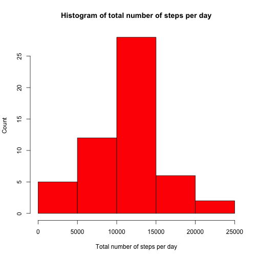
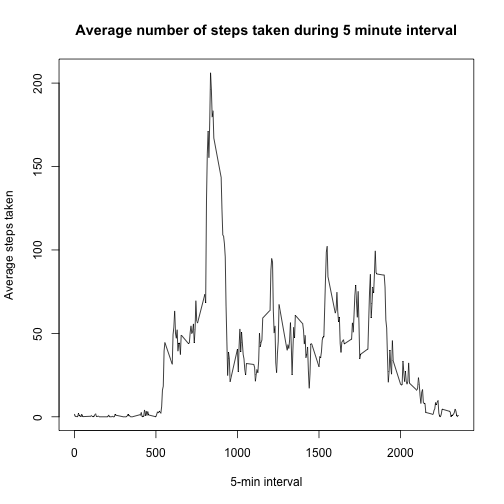
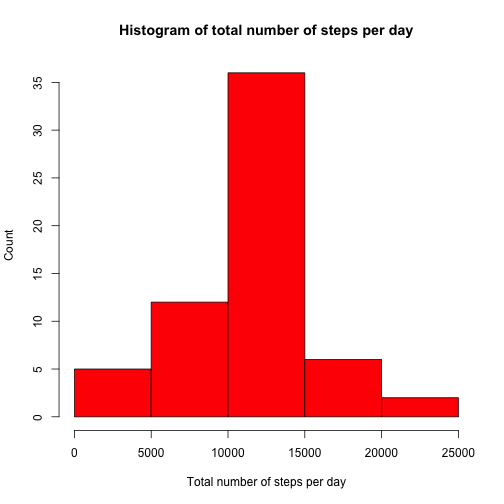
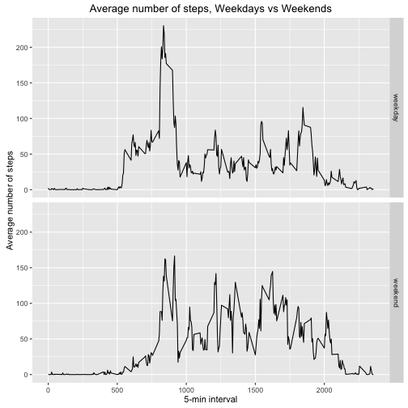

Load the data and remove NAs, Date is converted and stored as proper date


```r
data<-read.csv("activity.csv")
data2<-na.omit(data)
data2$date<-as.Date(data2$date,"%Y-%m-%d")
```

Loading dplyr package, Group by date and summarize the sum of steps


```r
library(dplyr)
stepsPerDay<-summarize(group_by(data2,date),sum(steps))
```

Make a histogram of steps per day


```r
hist(stepsPerDay$`sum(steps)`,xlab="Total number of steps per day",ylab="Count",
     main="Histogram of total number of steps per day",col=2)
```



Calculate the mean and median for total number of steps


```r
meanSteps<-mean(stepsPerDay$`sum(steps)`)
medianSteps<-median(stepsPerDay$`sum(steps)`)
```

The mean total number of steps taken per day is 10766.1886792453 and the median is 10765

Group the data by the 5-min interval and calculate the average number of steps for each interval


```r
stepsPerInterval<-summarize(group_by(data2,interval),mean(steps))
```

Make a time series plot


```r
plot(stepsPerInterval$interval,stepsPerInterval$`mean(steps)`,
     type="l",xlab="5-min interval",ylab="Average steps taken",
     main="Average number of steps taken during 5 minute interval")
```




Find the interval with the maximum number of steps


```r
maxInterval<- stepsPerInterval$interval[which.max(stepsPerInterval$`mean(steps)`)]
```

The maximum number of steps was observed during interval 835

Calculate the total number of missing values 

```r
missingValues<-sum(is.na(data$steps))
```

There are 2304 missing values in the dataset

Filling the missing values of the dataset by assigning them with the average number of steps for the respective 5-min interval 


```r
filledData<-data
for (i in 1:nrow(filledData)){
        if (is.na(filledData$steps[i])){
                # find for which index value the interval matches the average number of steps
                index<-which(filledData$interval[i]==stepsPerInterval$interval)
                # Use this value instead of NA
                filledData$steps[i]<-stepsPerInterval[index,]$`mean(steps)`
        }
}
```

Transform the date variable for the filled dataset


```r
filledData$date<-as.Date(filledData$date,"%Y-%m-%d")
```

Plot the histogram of steps per day for the dataset without the missing values


```r
stepsPerDayFilled<-summarize(group_by(filledData,date),sum(steps))

hist(stepsPerDayFilled$`sum(steps)`,xlab="Total number of steps per day",ylab="Count",
     main="Histogram of total number of steps per day",col=2)
```




Calculate the mean and median for total number of steps


```r
meanStepsFilled<-mean(stepsPerDayFilled$`sum(steps)`)
medianStepsFilled<-median(stepsPerDayFilled$`sum(steps)`)
```

The mean total number of steps taken per day is 10766.1886792453 and the median is 10766.1886792453. The mean total number of steps is the same after replacing the missing values with the averge for each interval.The median has increased and now it is equal to the mean. As a result, imputing mising data only affects the median.

Create a variable with weekdays, define all days as weekdays, then define days that are Saturday or Sunday as weekends 


```r
filledData$day<-weekdays(filledData$date)
filledData$dayClass <-"weekday"
filledData$dayClass[filledData$day %in% c("Saturday","Sunday")]<-"weekend"
```


Group the data by the 5-min interval and calculate the average number of steps for each interval (and type of day)


```r
stepsPerDay<-summarize(group_by(filledData,dayClass,interval),mean(steps))
```

loading the ggplot2 package


```r
library(ggplot2)
```

We use qplot to demonstrate the differences between weekdays and weekends 


```r
qplot(interval,`mean(steps)`,data=stepsPerDay,
      geom="line",xlab="5-min interval",ylab="Average number of steps",
      main="Average number of steps, Weekdays vs Weekends",
      facets=dayClass~.)
```



